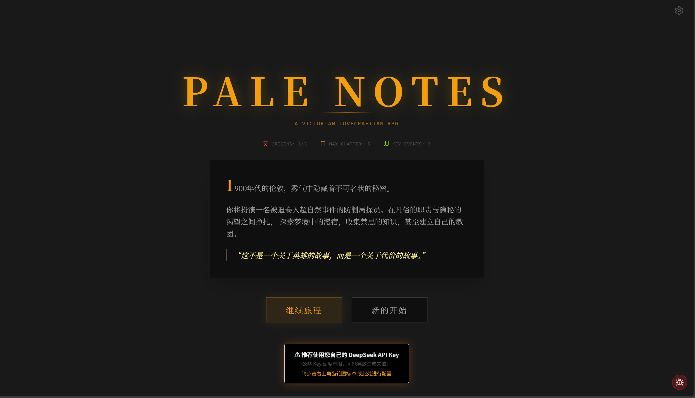
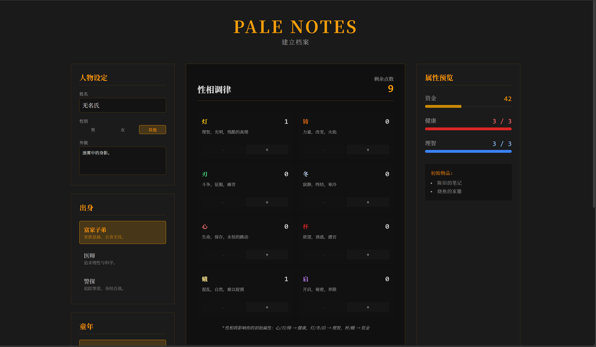
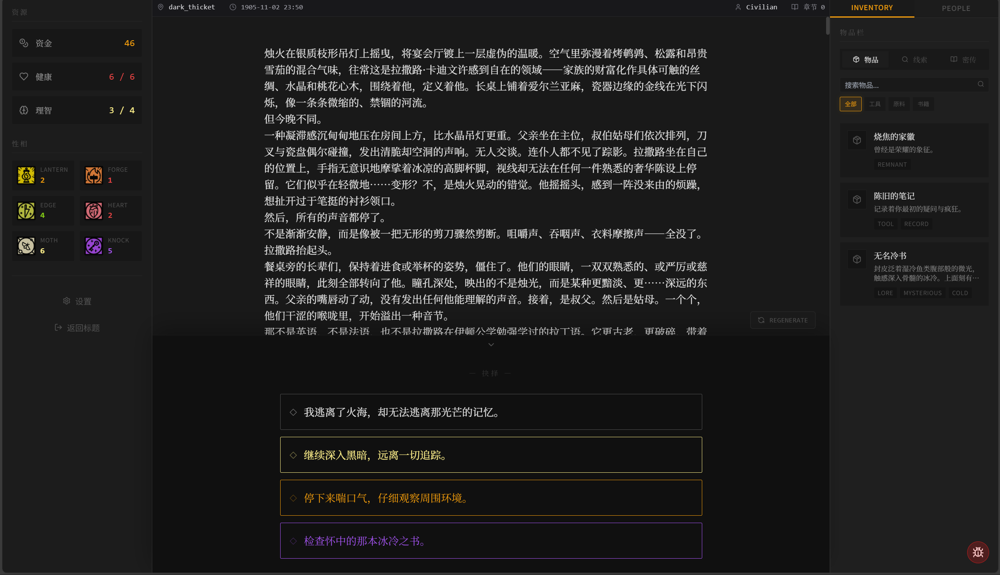

# 🕯️ Pale Notes | 苍白卷宗

> "在1900年代的伦敦阴影下，凡俗的职责与隐秘的渴望交织..."



**Pale Notes (苍白卷宗)** 是一款由 **LLM (DeepSeek R1)** 驱动的文字角色扮演游戏。它深受《密教模拟器 (Cultist Simulator)》与《无光之海 (Sunless Sea)》等“天气工厂”风格作品的启发，旨在探索大语言模型在沉浸式叙事与动态游戏机制结合上的可能性。

在这个游戏中，没有固定的剧本。你的每一个选择，都会被 AI 实时演绎，编织出独一无二的故事。

---

## 📖 游戏背景

你将扮演一名被迫卷入超自然事件的**防剿局 (Suppression Bureau)** 探员。
这是一个位于伦敦警务系统边缘的“杂务课”，负责处理所有无法解释的“非标准事件”。

在凡俗的职责（监视、销毁、归档）与隐秘的渴望（飞升、漫宿、禁忌知识）之间挣扎。
你需要管理你的**理智**、**健康**与**资金**，收集禁忌的**密传**，甚至建立自己的教团，最终决定是维护摇摇欲坠的秩序，还是拥抱不可名状的飞升。

## ✨ 核心特色

### 1. 无限叙事 (Infinite Narrative)
游戏的核心由 **DeepSeek R1** 模型驱动。所有的剧情描述、NPC对话、环境互动均由 AI 实时生成。
- **沉浸式文风**：经过精心调优的 Prompt Engineering，确保 AI 输出符合“维多利亚+克苏鲁”的独特文学风格。
- **动态世界**：你的出身、童年经历、性格特质都会被 AI 记住，并在后续的剧情中产生微妙的影响。

### 2. 性相系统 (Aspects System)
你的行为由八种核心**性相**主导：
- 🕯️ **灯 (Lantern)**：理智，光明，残酷的真理。
- 🔥 **铸 (Forge)**：力量，改变，火焰。
- 🔪 **刃 (Edge)**：斗争，征服，痛苦。
- ❄️ **冬 (Winter)**：寂静，终结，寒冷。
- ❤️ **心 (Heart)**：生命，保存，永恒的跳动。
- 🍷 **杯 (Grail)**：欲望，诱惑，感官。
- 🦋 **蛾 (Moth)**：混乱，自然，难以捉摸。
- 🚪 **启 (Knock)**：开启，秘密，界限。



### 3. 资源管理 (Resource Management)
你需要小心平衡三种生存资源：
- **资金 (Funds)**：世俗的通行证。
- **健康 (Health)**：肉体的容器。
- **理智 (Sanity)**：认知的边界。

资源归零并不意味着简单的 Game Over，而是引导故事走向不同的结局（如发疯、病逝或流落街头）。

### 4. 物品与密传 (Inventory & Lore)
收集散落在伦敦各处的**物品**与**密传**。
- 阅读禁书可能获得知识，也可能通过检定失败而丧失理智。
- 物品不仅是工具，更是解开谜题的钥匙。



---

## 🛠️ 技术栈

本项目基于现代前端技术栈构建：

- **Framework**: [React 18](https://react.dev/)
- **Build Tool**: [Vite](https://vitejs.dev/)
- **Language**: [TypeScript](https://www.typescriptlang.org/)
- **Styling**: [Tailwind CSS](https://tailwindcss.com/)
- **Animation**: [Framer Motion](https://www.framer.com/motion/)
- **State Management**: [Zustand](https://github.com/pmndrs/zustand)
- **Icons**: [Lucide React](https://lucide.dev/)
- **AI Integration**: DeepSeek API

---

## 🚀 快速开始

### 前置要求
- Node.js (v16+)
- npm 或 yarn

### 安装与运行

1. **克隆仓库**
   ```bash
   git clone https://github.com/your-username/pale-notes.git
   cd pale-notes
   ```

2. **安装依赖**
   ```bash
   npm install
   ```

3. **启动开发服务器**
   ```bash
   npm run dev
   ```

4. **构建生产版本**
   ```bash
   npm run build
   ```

---

## ⚙️ 配置说明

游戏依赖 **DeepSeek API** 进行内容生成。

1. 启动游戏后，点击右上角的 **设置 (Settings)** 图标。
2. 输入您的 DeepSeek API Key。
   - *注意：您的 Key 仅存储在本地浏览器 (localStorage) 中，不会上传到任何服务器。*
3. (可选) 如果您没有 Key，可以使用游戏内置的公共 Key 进行体验（额度有限）。

---

## 🤝 贡献

欢迎提交 Issue 或 Pull Request！
如果你有好的剧情想法、Prompt 优化建议或发现了 Bug，请随时告诉我们。

### ⭐ Star Us!
如果你喜欢这个项目，请在 GitHub 上为我们点亮一颗星！这如同灯的光辉，将指引我们继续前行。

---

## ⚖️ 版权与许可 (Copyright & License)

### 免责声明
本游戏页面是基于 **Weather Factory** 的游戏 **《司辰之书 (Book of Hours)》** 和 **《密教模拟器 (Cultist Simulator)》** 的二次创作。
- 本项目中使用的美术素材、世界观设定及相关概念，其版权均归 **Weather Factory** 所有。
- 我们仅将其用于非商业性质的二创开发与学习交流。
- 如果存在著作权侵犯或争议，请立即联系本人进行处理。

### 使用条例
- **非商业用途**：本项目严禁用于任何商业用途。
- **二次开发**：允许基于本项目进行二次开发或创作，前提是：
  1. 不涉及任何商业利益。
  2. 遵守 Weather Factory 的相关二创规定。
  3. 保留原作者的署名与版权声明。
- **联系方式**：如果有相关事宜或合作意向，请联系我。

---

<div align="center">
  <span id="busuanzi_container_site_pv">
    本站总访问量 <span id="busuanzi_value_site_pv"></span> 次
  </span>
  |
  <span id="busuanzi_container_site_uv">
    本站访客数 <span id="busuanzi_value_site_uv"></span> 人
  </span>
</div>
